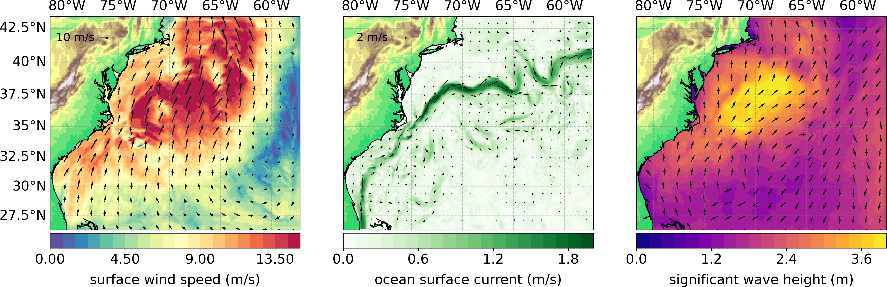

  <h2 align="center"> SCOAR TUTORIAL: NORTH ATLANTIC 10 KM </h2>

<h3>Case summary </h3>

This tutorial aims to showcase how to run the SCOAR Regional Coupled system using a simple case over the North Atlantic. The chosen domain is illustrated in the figure above. Data are avaialble to run 2 days starting December 1st, 2018.

<h3>Input Data </h3>
<h4>WRF inputs</h4>
<h4>ROMS inputs</h4>
<h4>WW3 inputs</h4>
<h4>Grids and Templates</h4>

<h3>Executables</h3>
<h4> Fortran codes compilation </h4>

<h4>Models</h4>
<h5>WRF</h5>
<h5>ROMS</h5>
<h5>WW3</h5>

<h3>Run SCOAR</h3>

main namelist and job submission

output in Run/ directory and post-process
